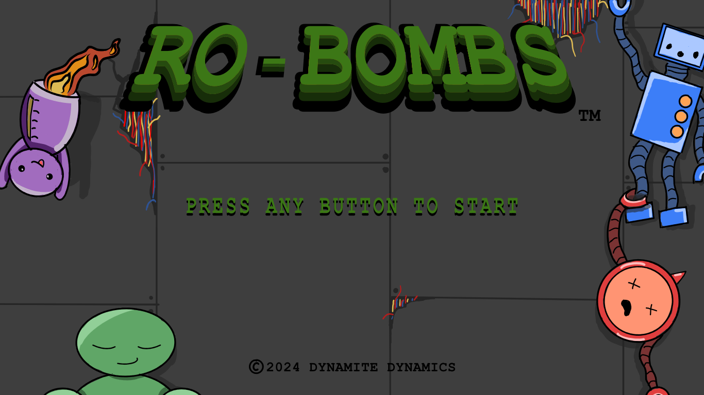

# RO-BOMBS

A minigame-based arcade game, product of a group project, in which Engineers, Designers and Artist come together to develop a game in 2 weeks.

   

## Overview

The player must complete continuously faster robot-based minigames and delay the defusal of the bomb. The game was created for a custom controller and has different keybinds for each minigame.

Developed by utilizing the GxP 2D Game Engine, provided by the institution.

## Features

### Gameplay (Engineers)

- **Minigame manager** Controls when new minigames should appear and how they scale with difficulty
- **3 Button minigames:**
  1. Dials: Player has to press the corresponding dial at the correct time
  2. Simon Says: The player has to order the numbers/equation in increasing order
- **1 Button minigames:** 
  1. Dino game: The player has to jump over the obstacles with the right timing
  2. Pump: The player has to continue pumping until the timer runs out
- **Switch minigames::**
  1. File current: The player has to keep the corrupted files away form the goal by changing their path
  2. Power-up: The player has to keep the power at the correct place until the timer runs out
- **D-pad minigames::**
  1. Sine Wave: The player align the wave with the background before the timer runs out
  2. Maze: The player has to rearrange the maze section in order to connect the path to the end 

### UI/UX, SFX, VFX (Designers and Artists)

- **Start and end screen**
- **HUD:**
  1. Difficulty level
  2. Score
  3. Highscore
- **Sounds**
  1. Background sounds
  2. Sound effects
- **Particle:**
  1. Bomb explosion
 
### Level editing
Done by using [Tiled](https://www.mapeditor.org/) level editor

## Controls
  
  Disclaimer: The keybinds are unconventional because they had to be mapped onto a physical controller
- **3 Button minigames:** Press H, J or K to interact with the corresponding elements
- **1 Button minigames:** Press C to interact with the corresponding element
- **Switch minigames:** Press or let go of B to interact with the corresponding element
- **D-pad minigames:** Control the minigame with W, A, S, D and Space

## Game Design and controller development
Done by: @AndriiTaizhkorob, @Connor Smith

## Art
Done by: @Larissa Landstra, @Nikki Joren
